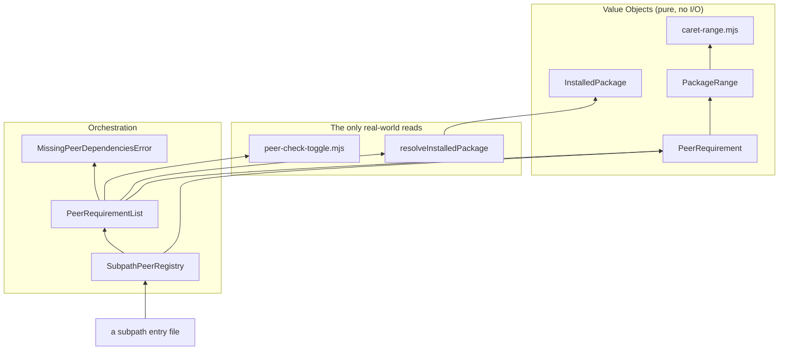

[🏠 Home](../README.md) · [🚀 Tutorial](./tutorial.md) · [🛠️ How-to](./how-to.md) ·
[📖 Reference](./reference.md) · **💡 Explanation**

# 💡 Explanation

## Why one package, not five

A team wants the same house style installed consistently, not to pick configs à la carte across
separate repos. Five packages means five versions and five changelogs to keep in sync for no benefit
at this size. The `exports` map lets each subpath resolve independently from one package instead
(same model as [@vercel/style-guide](https://github.com/vercel/style-guide)).

## Why every peer dependency is optional

`peerDependenciesMeta.<name>.optional: true` on every peer means installing this package alone pulls
in nothing else. A consumer using only `/prettier` never gets nudged about `eslint` or `tsdown`.

## Why no build step and no barrel file (mostly)

Most subpaths ship their source files as-is. Nothing needs transpiling, and a barrel `index.ts`
would force every consumer to pull in every subpath's dependencies just to import one: importing it
just for `/prettier` would still try to load `/eslint`'s module and crash on a missing `@eslint/js`
peer that consumer never installed. Tree-shaking usually handles barrel files fine, but "usually"
isn't good enough here: when a bundler doesn't fully eliminate the unused re-exports, a consumer
ends up with every subpath's code (and its peer requirements) pulled in regardless. Not worth the
risk for a package whose whole point is "install only what you use." `./tsdown` is the one exception
(see below).

## Why `./tsdown` is the one export that's built

Every other subpath ships as-is (see above), but `./tsdown` resolves to built `dist/` output instead
of the checked-in `tsdown/base.ts` source. The difference: every other subpath is either inert data
(`.json`, `.yml`) or JS that a consumer's own bundler/runtime loads, so shipping raw source is fine.
`./tsdown` is different: it gets executed directly by tsdown's own config loader, `unrun`, when a
consumer's `tsdown.config.ts` does
`import { defineLibraryConfig } from "@arnaud-zg/configs/tsdown"`. `unrun` relies on Node's
`--experimental-strip-types`, which deliberately refuses to strip types for any file resolved under
`node_modules` (a safety/perf heuristic against transforming third-party code, not a bug). So raw
`tsdown/base.ts` published as the `./tsdown` export target fails to load for every real consumer,
even though it works fine when this repo builds it via a same-directory relative import, which is
exactly why the original test suite didn't catch it, and why the regression test for this imports
the packed tarball through its real `node_modules` resolution rather than a relative path.

## Why `tsdown.config.ts` in this repo passes `exports: false`

`tsdown`'s shared config auto-generates `package.json`'s `exports` map from `entry` by default,
convenient for a library with one entry point. This package hand-maintains its own 17-entry
`exports` map, so its self-build overrides that default off. This isn't hypothetical: it happened
once and collapsed the real map down to one entry before being caught.

## The `${configDir}` limitation

TypeScript's `${configDir}` template is meant to let a base tsconfig's paths resolve relative to
whatever extends it, but with this package's target TypeScript version, it only expands inside
`compilerOptions` fields, not top-level `include`/`exclude`. Several variants use it there anyway,
so a project extending them and relying on the inherited `include` will hit "No inputs were found."
Always declare your own `include`/`exclude`.

## Why releases are manual, no CI

There's only one package here, no multiple packages whose versions need consolidating, no
cross-package changelog to generate. At that scale, a CI release pipeline is machinery with nothing
proportionate to run it for. A hand-maintained `CHANGELOG.md` and the native `pnpm version` /
`pnpm publish` commands are enough, and every release already goes through a reviewed PR regardless
(see below), so CI wouldn't add a review step that doesn't already exist. Revisit this if the repo
ever grows into multiple packages that need coordinated releases.

## Why commitlint instead of a hand-rolled script

The `commit-msg` hook used to run a hand-rolled shell script (`grep -qE` against a fixed pattern).
Every wrinkle (merge/revert commits, the optional `[JIRA-1]` tag, breaking-change `!`) was a
manually maintained regex edge case. `commitlint` and `@commitlint/config-conventional` already
encode that grammar as a maintained package; `@arnaud-zg/configs/commitlint` just extends it and
adds one rule, a mandatory scope. Bonus: unlike the old script, `pnpm exec commitlint --edit {1}`
doesn't hardcode a `node_modules/@arnaud-zg/configs/...` path, so the `lefthook-local.yml` override
this repo needed just to work around that path is gone too.

## Why `main` is protected via Lefthook

This is an opinionated choice, not a default: direct commits to `main` are not acceptable, every
change goes through a branch and a PR. `git commit --no-verify` can still bypass the hook, that's
intentional too, it's a local, client-side check, not a security boundary. The point isn't to make
bypassing impossible, it's to make bypassing something you have to choose to do, not something that
happens by accident. Real enforcement (blocking a bypassed push, not just a local commit) needs
GitHub branch protection on `main` configured server-side; the Lefthook hook alone can't provide
that.

## The peer-check engine

`internal/` checks that a subpath's declared peers are actually installed, at the right version, the
moment that subpath is imported. It's modeled as pure values plus one boundary, not one big
function, so most of it is unit-testable with no fixture at all.

- **`PackageRange`, `InstalledPackage`, `PeerRequirement`** are Value Objects: immutable, defined
  entirely by their data, safe to construct by hand in a test. `PeerRequirement#checkAgainst` takes
  an `InstalledPackage` as an argument; it never resolves one itself.
- **`resolve-installed-package.mjs`** is the one place this domain touches disk. Everything above it
  in the diagram is provably pure.
- **`peer-check-toggle.mjs`** is the other real-world read: the `ARNAUD_ZG_CONFIGS_SKIP_PEER_CHECK`
  escape hatch, checked once per subpath, in one place.
- **`PeerRequirementList`** is where the two meet: it asks the resolver for real facts, asks each
  requirement to check itself, and throws `MissingPeerDependenciesError` if anything failed.
- **`SubpathPeerRegistry`** is what every subpath entry file actually calls: it owns the
  subpath-to-peer-names table and builds the `PeerRequirement`s a `PeerRequirementList` needs.

No Entity lives here, on purpose: nothing in this domain has identity that survives a state change.
Every piece is either a stateless fact, resolved fresh each time, or a stateless comparison against
it.

## Why `resolve-installed-package.mjs` has a performance regression test

`SubpathPeerRegistry#requirementsFor` (see above) runs synchronously at import time, which means
`resolveInstalledPackage` runs on every consumer's tool startup: every `eslint`, `prettier`,
`tsdown`, `remark`, and `commitlint` invocation, not just once in CI. Measured against this repo's
own 19 declared peers, the real cost is under 10ms total, including the directory-walk fallback for
packages like `remark-cli` whose `exports` field blocks `require()`-based resolution. That's cheap
enough to not matter next to what those tools already cost to start up, but nothing stops a future
change from replacing the `require()`/`readFileSync` fallback with something categorically slower, a
spawned process or a registry network call, and that regression wouldn't show up in any other test
here: the correctness tests only assert _that_ a version resolves, not how.

`internal/resolve-installed-package.integration.test.ts` guards against that with a generous
threshold (200ms for all 19 peers, ~30x today's measured cost), not a tight one. A tight budget
would flake on a slow CI runner without catching anything a generous one doesn't; the point is to
catch "someone made this categorically slower," not to chase milliseconds.

### Why there's a second guard for a huge, deeply-nested monorepo

A natural worry: does this get slower for a consumer with a huge codebase, say a monorepo with
hundreds of thousands of lines across thousands of files? No — `resolveInstalledPackage` never reads
anything but `package.json` files on the single path between its own location and wherever the
target package's `node_modules` folder sits, so total file count and lines of code in the consuming
repo are irrelevant. The one variable that actually drives its cost is directory depth: how many
levels separate this package's installed location from the `node_modules` that holds the peer.

That's the realistic way a "huge organization" repo could differ from this one: a package many
workspace layers deep in a large Bazel/Nx-style monorepo, or an unhoisted npm install with deep
transitive nesting, rather than a normal-depth `node_modules`. Measured by hand while writing the
second describe block in `resolve-installed-package.integration.test.ts`, the walk fallback costs
roughly 0.025ms per directory level, linearly, up to 150 levels (already deeper than any real
npm/pnpm/yarn install has been seen to nest) for under 4ms total. The test fixes `DEPTH` at 100 — an
unrealistic worst case on its own — and still asserts a 50ms ceiling on top of that, about 10x
today's measured cost at that depth, for the same reason the first guard's threshold is generous:
catch a categorical regression, don't chase milliseconds or flake on a slow runner.
