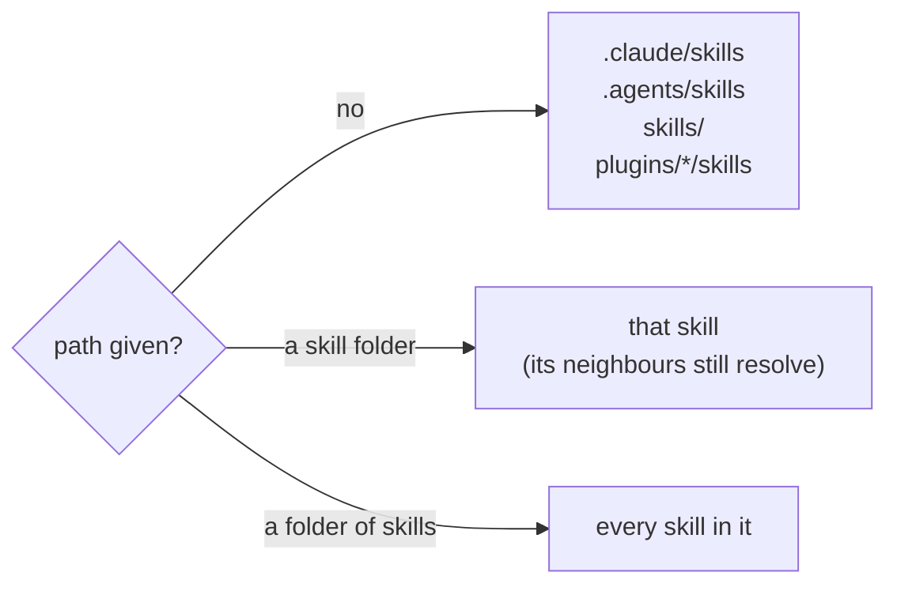

# 📖 Reference

What the check reads, what it looks for, and what it prints.

## Command

```text
node scripts/check.mjs [path ...] [--suite <script>] [--json]
```

| Option           | Does                                                              |
| ---------------- | ----------------------------------------------------------------- |
| `path`           | a folder of skills, or one skill's folder; several are allowed    |
| `--suite <name>` | also require every test to be named in that `package.json` script |
| `--json`         | print the result as JSON instead of text                          |
| `-h`, `--help`   | print the usage                                                   |

| Exit | Means                                                                 |
| ---- | --------------------------------------------------------------------- |
| `0`  | every skill holds all four rules                                      |
| `1`  | at least one finding                                                  |
| `2`  | nothing to check: no skills, a path that does not exist, a bad option |

Colour is on in a terminal, and off in a pipe or when `NO_COLOR` is set. `FORCE_COLOR=1` turns it
on.

## Where it looks



A skill is a folder with a `SKILL.md`. Links are followed. `node_modules`, `.git` and files over 1
MB are skipped.

## The rules

| Rule       | Finds                                                                           | Limit           |
| ---------- | ------------------------------------------------------------------------------- | --------------- |
| `named`    | no frontmatter; `name` not the folder's; a name not lowercase-hyphen words      | 64 characters   |
|            | no `description`; a description without "use" or "when"; a description too long | 1024 characters |
| `small`    | a `SKILL.md` body (frontmatter not counted) over the limit                      | 150 lines       |
|            | any other `.md` page over the limit                                             | 300 lines       |
| `resolves` | a pointer to a file or heading that does not exist (see below)                  |                 |
|            | a cited story `E-NN` with no `## E-NN` heading or `**E-NN**` in `evidence.md`   |                 |
| `tested`   | a script under `scripts/` that no test names                                    |                 |
|            | with `--suite`: a test the suite script does not name                           |                 |

### What counts as a pointer

| Written as                                            | Checked                                         |
| ----------------------------------------------------- | ----------------------------------------------- |
| `[text](page.md)`, `[text](dir/)`                     | from the page's own folder                      |
| `[text](page.md#heading)`, `[text](#heading)`         | the heading, by its GitHub anchor               |
| `[text](../other-skill/page.md)`                      | in the neighbouring skill                       |
| `${CLAUDE_SKILL_DIR}/scripts/run.mjs`                 | from the skill's root, even inside a code block |
| `scripts/run.mjs` in prose                            | only when the skill has a `scripts/` folder     |
| a URL, `mailto:`, `/absolute`, `../../…`              | never: it belongs to the web or to the project  |
| anything in a code block or in `` `[inline](code)` `` | never: it is an example                         |

### What counts as a script and a test

| Kind   | Matches                                                                        |
| ------ | ------------------------------------------------------------------------------ |
| script | `scripts/**` ending `.js`, `.mjs`, `.cjs`, `.ts`, `.mts`, `.cts`, `.py`, `.sh` |
| test   | `*.test.*`, `*.spec.*` (JS or TS), `test_*.py`, `*_test.py`                    |

A test reaches a script when it names its file, its quoted name, or imports it in Python. A script a
reached script names is reached too.

## JSON output

```json
{
  "skills": [{ "name": "release-notes", "path": ".claude/skills/release-notes" }],
  "findings": [
    {
      "skill": "release-notes",
      "rule": "resolves",
      "file": "SKILL.md",
      "line": 8,
      "message": "format.md does not exist",
      "fix": "point at where it lives now, or remove the pointer",
      "path": ".claude/skills/release-notes/SKILL.md"
    }
  ]
}
```

## Files

| File                 | Is                                                     | Read by |
| -------------------- | ------------------------------------------------------ | ------- |
| `SKILL.md`           | the entry: the rules, the check, how to create a skill | Claude  |
| `guards.md`          | seven mistakes no script can see                       | Claude  |
| `evidence.md`        | the story behind each rule and guard                   | Claude  |
| `scripts/check.mjs`  | the command line                                       | Node    |
| `scripts/rules.mjs`  | the four rules, pure functions                         | Node    |
| `scripts/shelf.mjs`  | finds and reads skills on disk                         | Node    |
| `docs/`, `README.md` | these pages                                            | people  |
