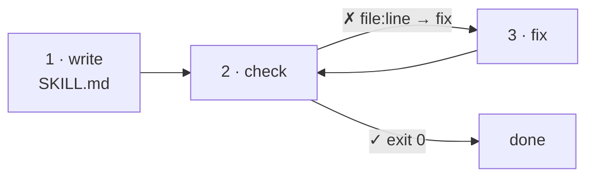
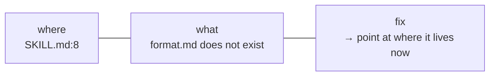

# 🚀 Tutorial: your first skill, checked

Ten minutes. You will write a skill with two mistakes in it, watch the check find both, fix them,
and get a clean result.



You need Node 22 or later, and the plugin installed (see [Install](../README.md#install)).

## 1. Write a skill

In any project, make `.claude/skills/release-notes/SKILL.md`:

```markdown
---
name: release-notes
description: Drafts release notes from the pull requests merged since the last tag.
---

# Release notes

Follow [the format](format.md), newest change first.
```

It has two mistakes. Can you see them?

## 2. Check it

Ask Claude to **check the skills**. Claude runs the check for you. You can also run it yourself from
the project's root:

```sh
node <skill folder>/scripts/check.mjs
```

```text
Checking 1 skill against named, small, resolves, tested

.claude/skills
  ✗ release-notes
      .claude/skills/release-notes/SKILL.md:3  named
      the description never says when to use the skill
      → add a "Use when …" sentence with the words a person would type
      .claude/skills/release-notes/SKILL.md:8  resolves
      format.md does not exist
      → point at where it lives now, or remove the pointer

✗ 2 findings in 1 of 1 skill.
```

Every finding has the same three parts:



## 3. Fix both

- **Say when to use it.** Claude decides whether to load a skill from its description alone. Add:
  `Use when asked to "write the release notes".`
- **Write the page you pointed at**, `.claude/skills/release-notes/format.md`:

  ```markdown
  # Format

  One line per change, in the past tense.
  ```

## 4. Check again

```text
Checking 1 skill against named, small, resolves, tested

.claude/skills
  ✓ release-notes

✓ 1 skill holds all four rules.
```

The check exits `0`. Your skill now fires when it should, and every pointer in it goes somewhere.

## Next

- 🛠️ [How-to](how-to.md): run the check in CI, require tests, read the JSON.
- 📖 [Reference](reference.md): what each rule looks for, exactly.
- 💡 [Explanation](explanation.md): why these four rules, and what no rule can see.
