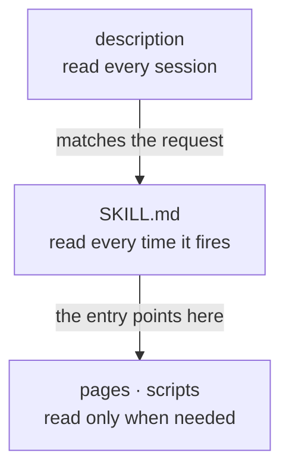
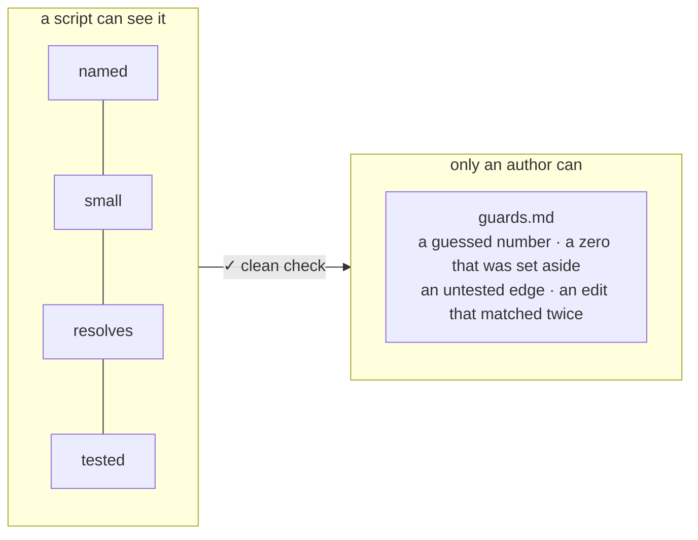

# 💡 Explanation

Why the skill works the way it does. For commands, read the [how-to](how-to.md).

## A skill's shape is its behaviour

A model follows a skill to the letter, and reads it in layers. What each layer costs decides how the
skill must be built.

- **The description is read always**, to decide whether to fire. If it never says _when_, the skill
  fires at the wrong time or never: that is `named`.
- **The entry is read every time it fires.** Each line in it is paid for on every call, so it routes
  rather than teaches: that is `small`.
- **Pages are read on demand.** A pointer to a page that moved sends the model nowhere, and it
  carries on without saying so: that is `resolves`.
- **Scripts run as written.** One nobody tests was only ever watched: that is `tested`.

## Four rules, and the rest is judgement

A rule is kept only if a script can check it **and** a skill once failed because of it. An earlier
version of this builder held twelve rules. Eight of them enforced a folder layout, cost dozens of
rewrites, and are recorded catching nothing. They went.

What a script cannot see is written down instead, as seven guards with the story behind each one. A
clean check says nothing about them, which is why the skill tells Claude to read them before writing
a number, an output or an edit script.

## Every rule has a story

The skill's `evidence.md` holds one story per rule and guard: a real failure, and what it cost. The
skill cites them as `(why: E-03)`, and `resolves` makes sure each citation has its story. A rule
nobody can explain is the first one to be relaxed. A rule with its story stays.

## Why it reads, and never writes

The check only reports. It changes no file, needs only Node, and opens no connection. So it is safe
to pre-approve, which the skill does for that one command. It can gate a commit or a CI job without
a second tool, and you can run it on a skill you have not decided to trust yet. Fixing is the
author's job, or Claude's, with the finding's `→` as the instruction.

## Why `README.md` and `docs/` sit outside the skill

`SKILL.md` and the pages it links are instructions: Claude follows them. A page written to convince
a person would be followed too. So the pages for people live beside the skill, and nothing Claude
reads points at them.
