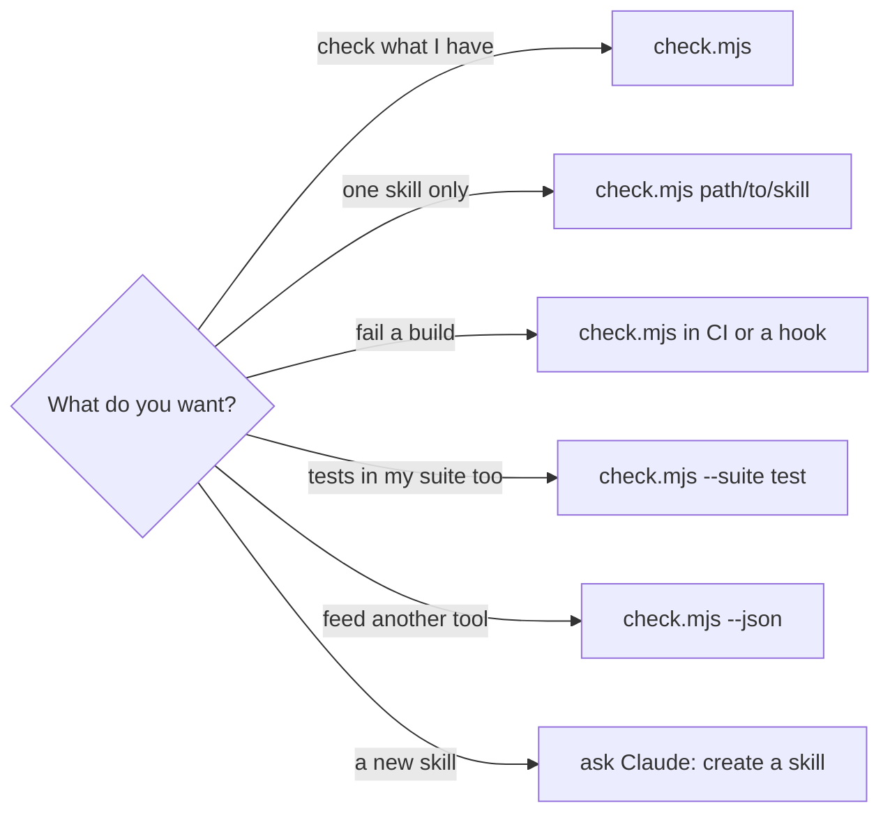
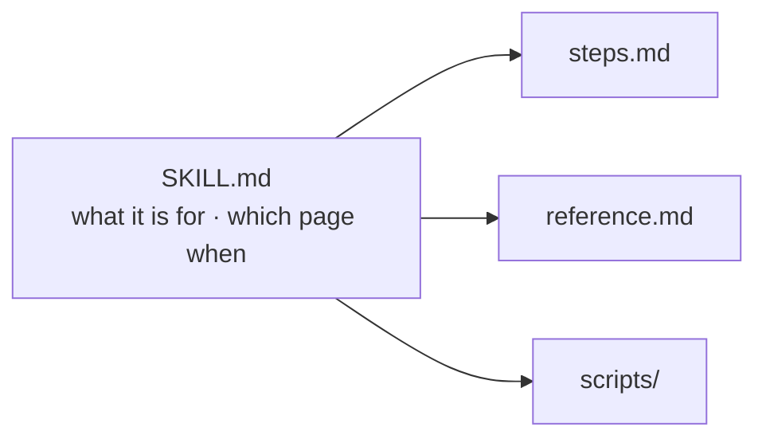

# 🛠️ How-to guides

Short recipes. New here? Start with the [tutorial](tutorial.md).



`check.mjs` is the skill's `scripts/check.mjs`. In Claude, ask to **check the skills** and it finds
it for you.

## Check every skill in a project

```sh
node <skill folder>/scripts/check.mjs
```

It looks in `.claude/skills`, `.agents/skills`, `skills/` and `plugins/*/skills` under the current
folder.

## Check one skill, or one folder of skills

```sh
node <skill folder>/scripts/check.mjs .claude/skills/release-notes
node <skill folder>/scripts/check.mjs vendor/skills
```

Checking one skill still reads its neighbours, so a link like `../other-skill/SKILL.md` resolves.

## Fail a build when a skill breaks

The check exits `1` on any finding. Copy the skill into the project once, so CI needs no network:

```sh
npx skills add arnaud-zg/configs --skill skill-builder -a claude-code -y --copy
```

Then run it in a job:

```yaml
- run: node .claude/skills/skill-builder/scripts/check.mjs
```

or before each commit, with Lefthook:

```yaml
pre-commit:
  commands:
    skills:
      glob: ".claude/skills/**"
      run: node .claude/skills/skill-builder/scripts/check.mjs
```

## Make sure every test actually runs

By default, `tested` asks only that each script has a test. To also require that the test is in the
script your project runs, name that script:

```sh
node <skill folder>/scripts/check.mjs --suite test
```

A test the script never names is a finding, with its path to add. Use it when the script lists its
test files, like `node --test a.test.mjs b.test.mjs`. A runner that finds tests on its own, such as
Vitest or Jest, already runs them all, so it needs no `--suite`.

## Use the results in another tool

```sh
node <skill folder>/scripts/check.mjs --json | jq -r '.findings[] | "\(.path):\(.line) \(.message)"'
```

The shape is in the [reference](reference.md#json-output).

## Create a skill

Ask Claude to **create a skill** that does what you need. It writes `SKILL.md` with a description
that says when to use it, keeps the entry short, and runs the check before it says it is done.

## Split a long entry

`small` fails when `SKILL.md` grows past 150 lines. Move one part into its own page and link to it:



Claude reads a page only when the entry sends it there, so a page costs nothing until it is needed.

## Say why a rule exists

Write the story once in `evidence.md`, as a heading, then cite it anywhere in the skill:

```markdown
## E-01 · The entry nobody finished reading
```

```markdown
Keep the entry short (why: E-01).
```

`resolves` fails on a citation with no story. Skills that share stories set
`metadata.family: <skill>` and cite that skill's `evidence.md`.
